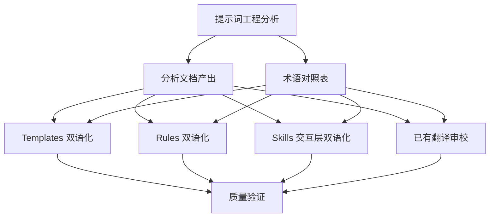

## 产品概述

对 Claude Code Game Studios 提示词工程项目进行全面分析和中英双语化改造，使其成为学习提示词工程的完整双语教程资源。

## 核心功能

- **提示词工程分析**：系统分析项目架构设计（Agent 层级体系、Skill 工作流编排、Rules 约束注入、Template 文档驱动、Hook 自动化校验），揭示每个组件的提示词设计模式和技巧
- **分层双语化改造**：按 README.md 已定义的优先级规则（Templates > Rules > Skills > Agents/Hooks），对全工程进行中英双语化，遵循已有的翻译规范
- **翻译质量提升**：修复现有机器翻译问题，统一术语，建立专业游戏开发术语对照表
- **学习导向优化**：在关键提示词设计决策处添加学习注释，解释"为什么这样设计"

## 双语化优先级（已有规则）

- Templates (模板) -- 绝对有必要，强烈建议双语/中文
- Rules (规则/约束) -- 很有必要，建议双语
- Skills (技能/工作流) -- 部分有必要，只做交互层双语
- Agents (代理/角色) -- 保持纯英文最佳
- Hooks (钩子/触发器) -- 完全没必要，保持纯英文

## 技术栈

- 文件格式：Markdown (`.md`)，含 YAML Frontmatter
- 自动化脚本：Python 3（已有 `_bilingualize_skills.py` 等工具）
- 版本控制：Git

## 实现方案

### 整体策略

采用"分析先行、分层推进、质量优先"的三阶段策略：

1. **分析阶段**：产出提示词工程分析文档，覆盖架构模式、设计技巧、质量评估
2. **双语化阶段**：按优先级分层执行（Templates > Rules > Skills > 其他），遵循已有翻译规范
3. **质量保障阶段**：术语统一、学习注释添加、最终校验

### 翻译规范（遵循 README.md 已有规则）

**Skill 翻译规则**：

- 只翻译向用户展示的文本（description、弹窗提问选项、生成的 Markdown 内容）
- 绝对保留：配置元数据（name、allowed-tools 等）、系统变量名、代码匹配正则、内部执行阶段（Phase 1/2/3）
- YAML description 字段采用 `"English / 中文"` 格式

**Template 翻译规则**：

- 标题保留英文骨架，后补充中文（如 `## Player Fantasy / 玩家幻想`）
- 注释全面汉化：指引性文本翻译为通俗易懂的中文
- 占位符双语化：`[在此处填写公式 / Insert formula here]`
- 严禁修改：YAML Frontmatter、文件路径引用、反引号包裹的代码字段

**Rules 翻译规则**：

- 核心标识符绝对保留（Rule ID、severity、文件路径限定）
- 约束描述双语化：`英文原文. / 中文翻译。`
- 技术术语使用"中文 (英文)"标准形式
- 代码块绝对不翻译

### 已有翻译格式模式

项目中已使用的双语格式：

- 标题：`## English Title / 中文标题`
- 翻译块：`> **中文翻译**：翻译内容`（引用块格式）
- 行内注释：`# English comment / 中文注释`
- 表格：英文表后紧跟中文翻译表

## 实施注意事项

- **不修改执行逻辑**：所有翻译工作不得改变任何功能行为、正则匹配、变量名、路径引用
- **术语一致性**：建立并维护统一的游戏开发术语对照表，避免同一术语不同翻译
- **保留原文**：英文原文始终完整保留，中文翻译作为补充而非替换
- **机器翻译需审校**：已有部分机翻内容（如 brainstorm SKILL.md）需人工审校修正

## 目录结构

```
e:\Work\Claude-Code-Game-Studios\
├── docs/
│   └── prompt-engineering-analysis.md    # [NEW] 提示词工程分析文档
│
├── .codebuddy/
│   ├── docs/
│   │   ├── glossary.md                   # [NEW] 中英术语对照表
│   │   └── templates/                    # [MODIFY] 38个模板文件双语化
│   │       ├── game-concept.md           # [MODIFY] 标题双语+注释汉化+占位符双语
│   │       ├── game-design-document.md   # [MODIFY] 同上
│   │       ├── architecture-decision-record.md  # [MODIFY] 同上
│   │       └── ... (其余35个模板)
│   │
│   ├── rules/                            # [MODIFY] 11个规则文件双语化
│   │   ├── ai-code.md                    # [MODIFY] 约束描述双语化
│   │   ├── data-files.md                 # [MODIFY] 同上
│   │   ├── design-docs.md                # [MODIFY] 同上
│   │   ├── engine-code.md                # [MODIFY] 已双语，审校
│   │   ├── gameplay-code.md              # [MODIFY] 已双语，审校
│   │   ├── narrative.md                  # [MODIFY] 约束描述双语化
│   │   ├── network-code.md               # [MODIFY] 同上
│   │   ├── prototype-code.md             # [MODIFY] 同上
│   │   ├── shader-code.md                # [MODIFY] 同上
│   │   ├── test-standards.md             # [MODIFY] 同上
│   │   └── ui-code.md                    # [MODIFY] 同上
│   │
│   └── skills/                           # [MODIFY] 交互层双语化
│       ├── brainstorm/SKILL.md           # [MODIFY] 审校修正机翻+交互层双语
│       ├── start/SKILL.md                # [MODIFY] 交互层双语
│       ├── help/SKILL.md                 # [MODIFY] 交互层双语
│       ├── design-system/SKILL.md        # [MODIFY] 交互层双语
│       └── ... (其余技能文件按需)
│
├── CODEBUDDY.md                          # [MODIFY] 已双语，审校
├── README.md                             # [MODIFY] 已双语，审校
└── docs/
    └── COLLABORATIVE-DESIGN-PRINCIPLE.md # [MODIFY] 补全缺失翻译
```

## 架构设计



## Agent Extensions

### Skill

- **brainstorm**: 使用 /brainstorm 技能的工作流设计模式作为提示词工程分析的重点案例，深入剖析其多阶段交互设计

### MCP

- **CloudBase AI ToolKit**: 使用 searchKnowledgeBase (skill 模式) 查询 CloudBase 相关的最佳实践，特别是微信小游戏开发场景下的提示词设计参考