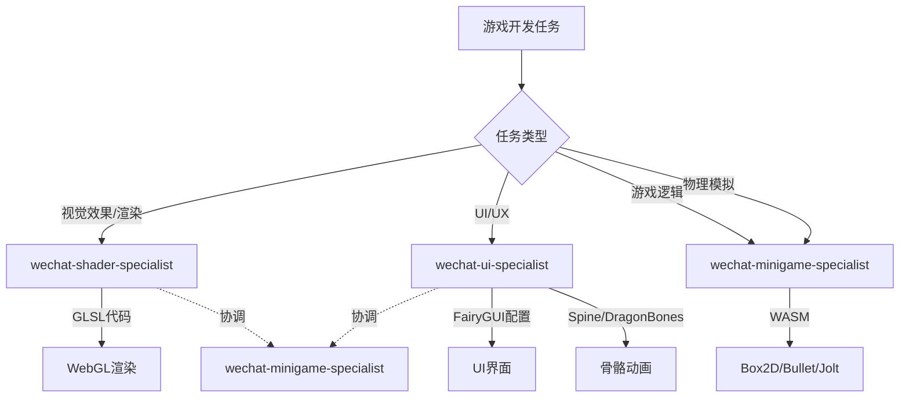

## 需求概述

为微信小游戏平台扩展专业Agent和Skill体系，实现职责分离的专业化开发流程：

### 新增Agent

1. **wechat-shader-specialist** - WebGL着色器专家
   - 精通WebGL 1.0/2.0各版本API和特性差异
   - 能够将GLSL/HLSL/ShaderLab等其他着色器语言转换为WebGL GLSL ES
   - 优化移动端GPU性能，处理精度问题（highp/mediump/lowp）

2. **更新 wechat-minigame-specialist** - 扩展能力范围
   - 添加物理引擎集成能力：Box2D.js, Bullet.js (ammo.js), JoltPhysics
   - WebAssembly (WASM)第三方库嵌入和使用（性能关键代码）

3. **wechat-ui-specialist** - 微信小游戏UI专家
   - 使用Figma/Sketch进行原型设计
   - 遵循iOS Human Interface Guidelines与微信设计规范
   - 设计视觉层级和交互反馈（点击态、加载态、过渡动画）
   - Photoshop/Illustrator切图和精灵图(Sprite Sheet)导出
   - Spine/DragonBones骨骼动画制作
   - FairyGUI界面拼装和自适应布局(Anchors & Stretch)

### 新增Skill

1. **/wechat-shader-setup** - 着色器项目初始化和转换
2. **/wechat-ui-design** - UI设计规范和FairyGUI配置

### 职责划分
- wechat-minigame-specialist：游戏逻辑代码开发
- wechat-ui-specialist：UI界面设计实现
- wechat-shader-specialist：视觉效果和渲染

## 核心功能

1. WebGL着色器开发支持（版本检测、语法转换、性能优化）
2. 物理引擎集成（WASM绑定、碰撞检测、刚体动力学）
3. UI全流程设计（原型->切图->动画->布局）


## 技术方案

### 架构设计

采用专业化分工架构，三个Agent各司其职：



### 技术栈整合

| Agent | 核心技术 | 输出物 |
|-------|----------|--------|
| wechat-shader-specialist | WebGL 1.0/2.0, GLSL ES | 顶点/片段着色器, 渲染管线配置 |
| wechat-ui-specialist | FairyGUI, Spine, DragonBones | UI包, 骨骼动画, 精灵图 |
| wechat-minigame-specialist | Box2D.js, ammo.js, JoltPhysics, WASM | 物理世界, 游戏逻辑 |

### WebGL版本兼容性处理

- 运行时检测WebGL版本：通过`canvas.getContext('webgl2')`回退到`webgl`
- 着色器预处理器：根据版本转换GLSL语法（如`in/out` vs `attribute/varying`）
- 特性检测矩阵：记录各版本支持的扩展和限制

### WASM集成方案

```javascript
// Box2D.js集成示例
const Box2D = await import('box2d.js');
const world = new Box2D.b2World(new Box2D.b2Vec2(0, -10));

// 内存管理：手动释放C++对象
Box2D.destroy(body);
```

### UI设计规范

- 视觉层级：遵循微信设计规范的色彩、字体、间距体系
- 交互反馈：统一的点击态(0.9缩放/透明度变化)、加载态(骨架屏/旋转图标)
- 自适应布局：基于安全区域和不同屏幕比例的锚点系统

### 文件组织

```
.codebuddy/
├── agents/
│   ├── wechat-shader-specialist.md      [NEW]
│   ├── wechat-ui-specialist.md          [NEW]
│   └── wechat-minigame-specialist.md    [MODIFY]
├── skills/
│   ├── wechat-shader-setup/SKILL.md     [NEW]
│   └── wechat-ui-design/SKILL.md        [NEW]
└── docs/
    ├── agent-roster.md                  [MODIFY]
    └── skills-reference.md              [MODIFY]
```

### 设计原则

1. **职责分离**：UI、Shader、Logic三个领域独立，避免功能混杂
2. **版本兼容**：WebGL 1.0/2.0自动适配，物理引擎WASM接口统一封装
3. **性能优先**：移动端GPU优化，WASM内存管理，精灵图合并
4. **规范驱动**：严格遵循微信设计规范和iOS HIG


## Agent Extensions

本项目无需额外扩展，使用现有CodeBuddy工具链完成Agent和Skill定义文件的创建。
