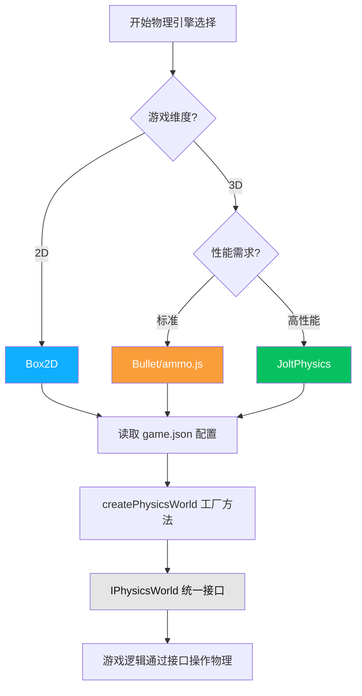

## 产品概述

重构微信小游戏 Agent 架构，以 `wechat-specialist` 为核心协调者（对标 unity-specialist/godot-specialist/unreal-specialist），将现有4个微信 Agent 调整为其子专家/协作者角色，新增3个物理引擎 Skill（Box2D/Bullet/JoltPhysics），并在 wechat-minigame-specialist 中引入统一的物理引擎接口抽象层。

## 核心功能

### 1. 新建 wechat-specialist（核心协调者）

- 参考 unity-specialist、unreal-specialist、godot-specialist 的 Delegation Map / Best Practices / Sub-Specialist Orchestration 模式
- 语言: TypeScript (首选), JavaScript, WXML, WXSS
- 架构模式决策: MVC 或 ECS
- 核心模块指导: 游戏循环 update(dt) 优化、状态管理（单例模式管理 GameState/UserData）、资源管理（预加载与释放，防止内存泄漏）
- 音频管理: 背景音乐与音效分离，处理 iOS 静音模式兼容
- 汇报给 technical-director (via lead-programmer)，委派给4个子专家

### 2. 重构 wechat-minigame-specialist（降级为子专家）

- 汇报给 wechat-specialist
- 专注: 小游戏主要功能实现 + 物理模块(Box2D/Bullet/JoltPhysics + WASM) + 动画模块(Spine/DragonBones)
- 切图导出精灵图(Sprite Sheet)
- 使用 Spine/DragonBones 制作骨骼动画
- 根据当前配置决定使用哪个物理引擎
- 使用接口模式抽象出统一的物理引擎调用接口（IPhysicsWorld, IPhysicsBody, IPhysicsShape 等）

### 3. 重构 wechat-shader-specialist（增强翻译能力）

- 参考 unity-shader-specialist、godot-shader-specialist 的职责结构
- WebGL 1.0/2.0 Shader 开发 + 后处理 + 渲染预算
- 翻译能力: Unity HLSL/ShaderGraph -> GLSL, Unreal Material -> GLSL, Godot Shader -> GLSL

### 4. 重构 wechat-ui-specialist（参考 unity-ui-specialist）

- 数据绑定、Screen Management、跨平台输入、性能标准、无障碍
- UI 默认适配竖屏屏幕
- 设计能力: Figma/Sketch 原型、iOS HIG 与微信规范
- 制作能力: FairyGUI 拼装界面、自适应布局(Anchors & Stretch)

### 5. 新增3个物理引擎 Skill

- `/wechat-physics-box2d`: 初始化 Box2D WASM，创建2D物理世界，配置碰撞和刚体
- `/wechat-physics-bullet`: 初始化 Bullet(ammo.js) WASM，创建3D物理世界，配置刚体/软体/碰撞
- `/wechat-physics-jolt`: 初始化 JoltPhysics WASM，创建高性能3D物理世界

### 6. 物理引擎接口抽象层

- 定义 IPhysicsWorld, IPhysicsBody, IPhysicsShape, IPhysicsJoint 等统一接口
- 具体实现: Box2DPhysicsWorld, BulletPhysicsWorld, JoltPhysicsWorld
- 工厂方法: createPhysicsWorld(engine, config) -> IPhysicsWorld
- 配置驱动: 根据 game.json 中的 physicsEngine 字段决定使用哪个引擎

### 7. 更新所有相关文档

- Agent 定义文件、Roster、Skills Reference、Readme 文档
- 新建 Unity Agent 协作指南和微信 Agent 协作指南

## 技术栈

- 文档格式: Markdown + YAML Front Matter
- 图表: Mermaid 流程图
- Agent 定义: YAML Front Matter + Markdown Body（遵循现有 `.codebuddy/agents/` 格式）
- Skill 定义: YAML Front Matter + Markdown Body（遵循现有 `.codebuddy/skills/` 格式）
- 接口语言: TypeScript（物理引擎抽象接口用 TypeScript 定义）

## 实现方案

### 架构重构核心

参考 Unity/Godot/Unreal 的 Agent 层级结构，建立 `wechat-specialist` 作为微信小游戏平台的 Engine Lead，与 unity-specialist、godot-specialist、unreal-specialist 并列。

```
Engine Leads:
  unreal-specialist -> UE Sub-Specialists
  unity-specialist  -> Unity Sub-Specialists
  godot-specialist  -> Godot Sub-Specialists
  wechat-specialist -> WeChat Sub-Specialists  [NEW]
```

### wechat-specialist 设计要点

- Delegation Map: 与 unity-specialist 完全对齐的汇报/委派/升级/协调结构
- Best Practices: TypeScript 编码规范、wx.* API 最佳实践、MVC/ECS 架构选择指南、游戏循环优化、状态管理单例模式、资源管理预加载/释放、音频管理
- Sub-Specialist Orchestration: 使用 Task 工具委派给4个子专家
- What This Agent Must NOT Do: 不做游戏设计决策、不直接实现功能(委派)

### 物理引擎接口抽象设计

采用策略模式(Strategy Pattern) + 工厂方法(Factory Method):

```typescript
// 统一接口层
interface IPhysicsWorld {
  createBody(def: BodyDef): IPhysicsBody;
  createJoint(def: JointDef): IPhysicsJoint;
  step(dt: number): void;
  raycast(origin: Vec2|Vec3, direction: Vec2|Vec3, maxDistance: number): RaycastHit[];
  destroy(): void;
}

interface IPhysicsBody {
  getPosition(): Vec2 | Vec3;
  setVelocity(vel: Vec2 | Vec3): void;
  applyForce(force: Vec2 | Vec3): void;
  applyImpulse(impulse: Vec2 | Vec3): void;
  setTransform(position: Vec2|Vec3, rotation: number): void;
  getType(): 'static' | 'dynamic' | 'kinematic';
  destroy(): void;
}

// 工厂方法
function createPhysicsWorld(engine: 'box2d' | 'bullet' | 'jolt', config: PhysicsConfig): IPhysicsWorld
```

每个物理引擎 Skill 负责初始化各自的 WASM 模块，wechat-minigame-specialist 通过统一接口操作物理世界，无需关心底层实现。

### wechat-minigame-specialist 重构要点

- 从协调者降级为功能实现子专家
- 汇报关系改为 wechat-specialist
- 保留物理引擎、WASM、骨骼动画代码示例
- 新增: 物理引擎接口抽象层代码、引擎选择决策逻辑
- 新增: 切图/精灵图制作能力说明
- 明确为功能实现者，不是架构决策者

### wechat-shader-specialist 重构要点

- 参考 unity-shader-specialist 的 Render Pipeline Standards / Shader Variants / Performance Optimization
- 参考 godot-shader-specialist 的 Shader Type / Code Standards / Particle Shaders
- 增强翻译对照表: Unity -> GLSL, Unreal -> GLSL, Godot -> GLSL 完整映射
- 增加 Shader 渲染预算、性能优化标准、常见反模式
- 汇报给 wechat-specialist

### wechat-ui-specialist 重构要点

- 参考 unity-ui-specialist 的 UI System Selection / Data Binding / Screen Management / Cross-Platform Input / Performance Standards / Accessibility
- 新增: 数据绑定模式 (GameState -> ViewModel -> UI)、Screen 栈管理系统
- 新增: 竖屏默认适配策略、触摸目标规范(48x48dp)、焦点管理
- 新增: UI 性能标准 (< 2ms CPU 帧预算)、虚拟列表、对象池
- 保留: Figma/Sketch 原型、FairyGUI 实现、Photoshop/Illustrator 资产制作
- 汇报给 wechat-specialist

## 目录结构

```
.codebuddy/agents/
├── wechat-specialist.md              # [NEW] 微信小游戏平台核心协调者
├── wechat-minigame-specialist.md     # [REWRITE] 降级为子专家，增加接口抽象层
├── wechat-shader-specialist.md       # [REWRITE] 增强翻译能力，参考unity/godot shader specialist
├── wechat-ui-specialist.md           # [REWRITE] 参考unity-ui-specialist，增加数据绑定/Screen管理/竖屏适配
└── wechat-cloudbase-specialist.md    # [UPDATE] 更新汇报关系

.codebuddy/skills/
├── wechat-physics-box2d/
│   └── SKILL.md                      # [NEW] Box2D物理引擎初始化Skill
├── wechat-physics-bullet/
│   └── SKILL.md                      # [NEW] Bullet物理引擎初始化Skill
├── wechat-physics-jolt/
│   └── SKILL.md                      # [NEW] JoltPhysics物理引擎初始化Skill
├── wechat-shader/
│   └── SKILL.md                      # [UPDATE] 对齐新shader specialist
└── wechat-ui-design/
    └── SKILL.md                      # [UPDATE] 对齐新ui specialist

.codebuddy/docs/
├── agent-roster.md                   # [UPDATE] 添加wechat-specialist为Engine Lead
└── skills-reference.md               # [UPDATE] 添加3个物理Skill

docs/Readme/
├── 04-Agents-Reference.md            # [UPDATE] 更新微信专家团队结构
├── 05-Skills-Reference.md            # [UPDATE] 添加物理Skill
├── 10-WeChat-Mini-Game-Guide.md      # [UPDATE] 更新Agent协作和工作流
├── 11-Unity-Agent-Collaboration-Guide.md  # [NEW] Unity Agent协作指南
└── 12-WeChat-Agent-Collaboration-Guide.md # [NEW] 微信Agent协作指南
```

## 设计风格

微信小游戏 Agent 协作架构图采用信息架构风格，清晰展示层级关系和数据流。

## 架构图

```mermaid
graph TD
    TD[technical-director] --> LP[lead-programmer]
    LP --> WS[wechat-specialist]
    
    WS --> WMS[wechat-minigame-specialist]
    WS --> WSS[wechat-shader-specialist]
    WS --> WUS[wechat-ui-specialist]
    WS --> WCS[wechat-cloudbase-specialist]
    
    WMS -->|使用| BOX2D[/wechat-physics-box2d]
    WMS -->|使用| BULLET[/wechat-physics-bullet]
    WMS -->|使用| JOLT[/wechat-physics-jolt]
    
    WMS -->|接口抽象| IPI[IPhysicsWorld]
    BOX2D -->|实现| IPI
    BULLET -->|实现| IPI
    JOLT -->|实现| IPI
    
    WSS -->|协作| WUS
    WMS -->|协作| WSS
    WMS -->|协作| WUS
    WMS -->|协作| WCS
    
    style WS fill:#07C160,color:#fff
    style WMS fill:#10AEFF,color:#fff
    style WSS fill:#FA9D3B,color:#fff
    style WUS fill:#FA5151,color:#fff
    style WCS fill:#666,color:#fff
    style IPI fill:#E5E5E5,color:#111
```

## 物理引擎选择流程图



## MCP

- **CloudBase AI ToolKit**
- Purpose: 验证微信云开发相关API和数据库结构，确保wechat-cloudbase-specialist文档准确性
- Expected outcome: 确认云函数、数据库、存储相关API和最佳实践

## Skill

- **setup-wechat-minigame**
- Purpose: 参考现有项目初始化Skill的结构，设计3个物理引擎Skill的格式
- Expected outcome: 物理引擎Skill遵循相同的前端YAML+Markdown结构模式