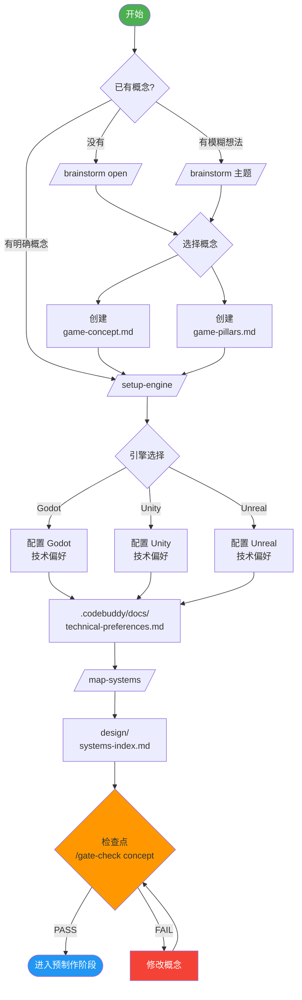
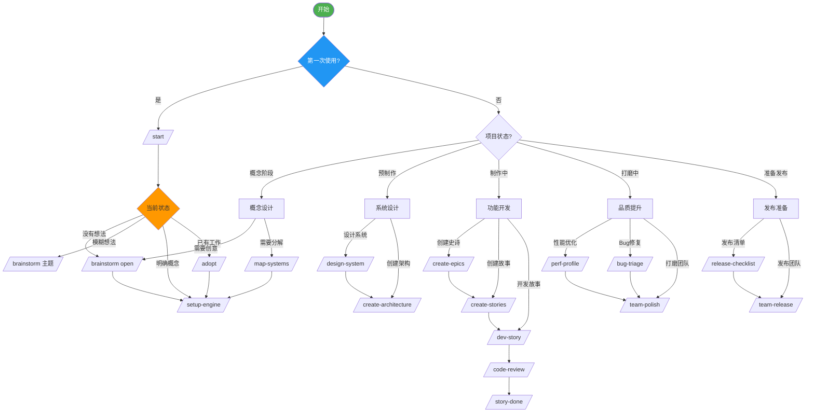
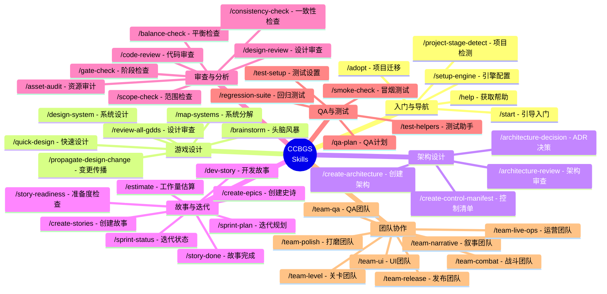
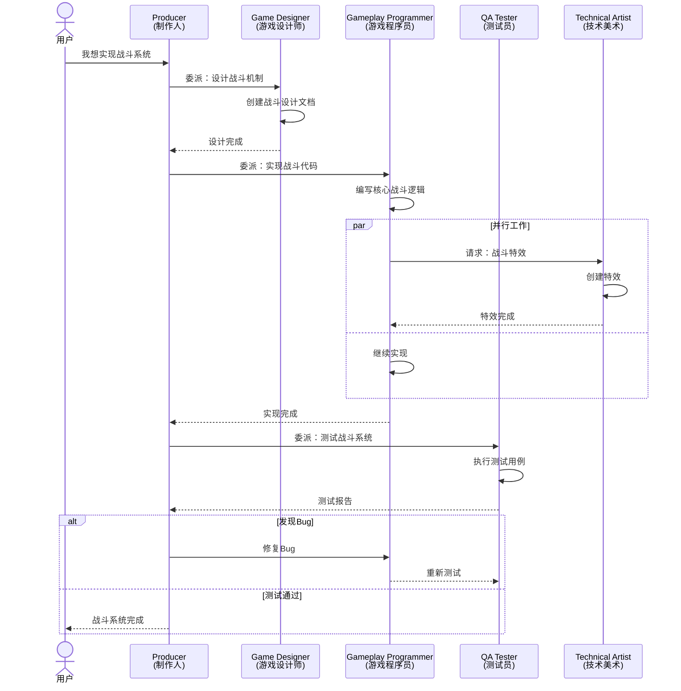
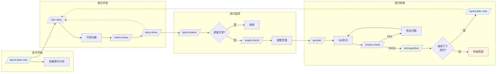
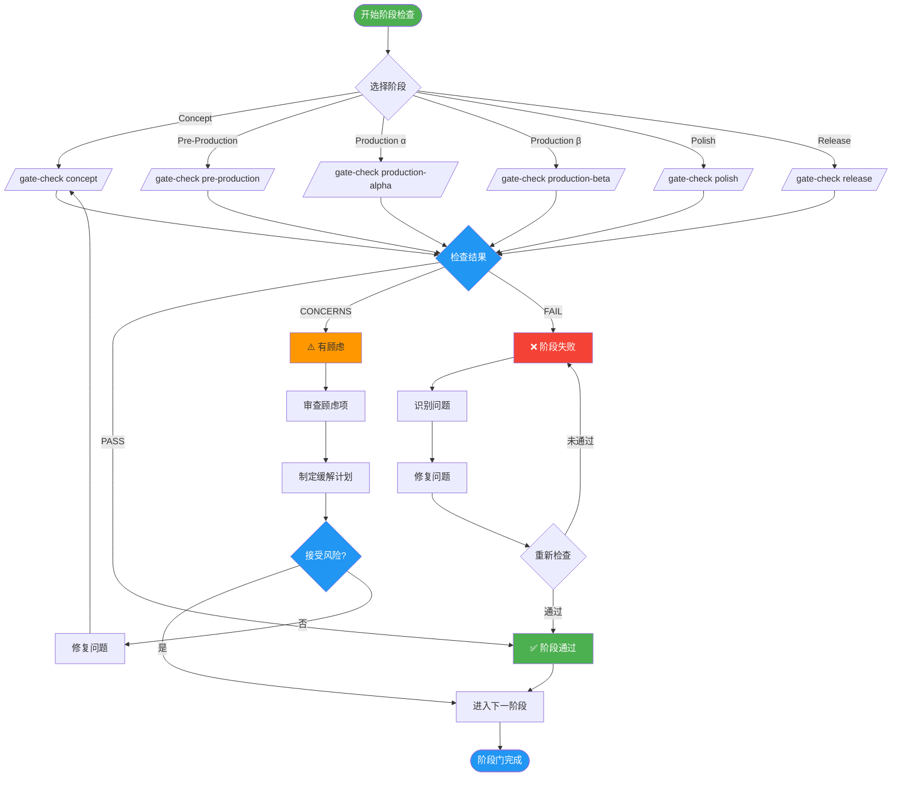
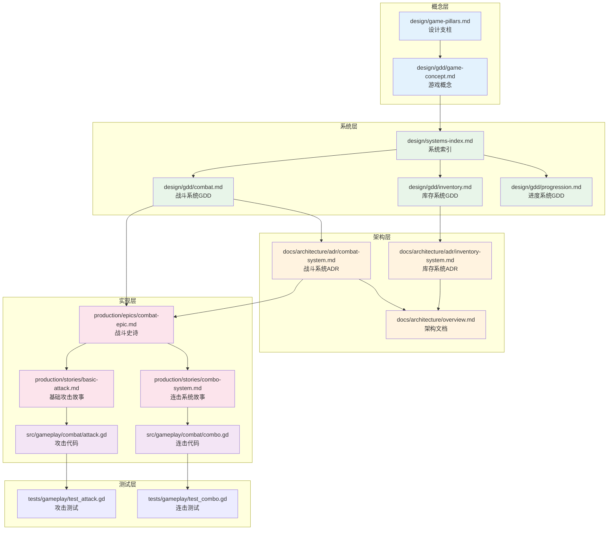

# Diagrams and Charts / 图表

This document contains various flowcharts and organizational charts for CodeBuddy Game Studios, written in Mermaid syntax.

> **中文翻译**：本文档包含 CodeBuddy Game Studios 的各种流程图和组织结构图，使用 Mermaid 语法编写。

---

## 1. 项目整体架构图

```mermaid
graph TB
    subgraph "项目根目录"
        CODEBUDDY[CODEBUDDY.md<br/>主配置文件]
        README[README.md<br/>项目介绍]
    end
    
    subgraph ".codebuddy/ 核心配置"
        direction TB
        AGENTS[agents/<br/>49 Agent定义]
        SKILLS[skills/<br/>72 Skill定义]
        HOOKS[hooks/<br/>12 钩子脚本]
        RULES[rules/<br/>11 规则文件]
        DOCS[docs/<br/>架构文档]
        SETTINGS[settings.json<br/>项目设置]
    end
    
    subgraph "游戏项目目录"
        direction TB
        SRC[src/<br/>源代码]
        DESIGN[design/<br/>设计文档]
        ASSETS[assets/<br/>游戏资源]
        TESTS[tests/<br/>测试套件]
        PROD[production/<br/>生产管理]
        PROTOS[prototypes/<br/>原型]
    end
    
    subgraph "知识管理"
        GRAPHIFY[graphify-out/<br/>知识图谱]
        DOCSROOT[docs/<br/>技术文档]
    end
    
    CODEBUDDY --> SETTINGS
    SETTINGS --> AGENTS
    SETTINGS --> SKILLS
    SETTINGS --> HOOKS
    SETTINGS --> RULES
    
    AGENTS -.-> SRC
    SKILLS -.-> DESIGN
    RULES -.-> SRC
    HOOKS -.-> PROD
    
    STYLE CODEBUDDY fill:#e1f5ff,stroke:#01579b,stroke-width:3px
    STYLE SETTINGS fill:#fff3e0,stroke:#e65100,stroke-width:2px
```

---

## 2. Agent 三层级组织结构图

```mermaid
graph TB
    subgraph "Tier 1: 领导层 (Leadership)"
        direction LR
        CD[🎨 Creative Director<br/>创意总监]
        TD[⚙️ Technical Director<br/>技术总监]
        PRODUCER[📊 Producer<br/>制作人]
    end
    
    subgraph "Tier 2: 部门主管 (Department Leads)"
        direction LR
        GD[🎮 Game Designer<br/>游戏设计师]
        LP[💻 Lead Programmer<br/>首席程序员]
        AD[🎭 Art Director<br/>艺术总监]
        AUD[🔊 Audio Director<br/>音频总监]
        ND[📝 Narrative Director<br/>叙事总监]
        QA[🐞 QA Lead<br/>QA主管]
        RM[📦 Release Manager<br/>发布经理]
        LL[🌍 Localization Lead<br/>本地化主管]
    end
    
    subgraph "Tier 3: 设计专家"
        direction LR
        SD[Systems Designer<br/>系统设计师]
        LD[Level Designer<br/>关卡设计师]
        ED[Economy Designer<br/>经济设计师]
        UX[UX Designer<br/>UX设计师]
    end
    
    subgraph "Tier 3: 程序专家"
        direction LR
        GP[Gameplay Programmer<br/>游戏程序员]
        EP[Engine Programmer<br/>引擎程序员]
        AIP[AI Programmer<br/>AI程序员]
        NP[Network Programmer<br/>网络程序员]
        UIP[UI Programmer<br/>UI程序员]
        TP[Tools Programmer<br/>工具程序员]
    end
    
    subgraph "Tier 3: 艺术与技术专家"
        direction LR
        TA[Technical Artist<br/>技术美术]
        SDES[Sound Designer<br/>声音设计师]
        WR[Writer<br/>编剧]
        WB[World Builder<br/>世界观设计师]
    end
    
    subgraph "Tier 3: 引擎专属专家"
        direction TB
        subgraph "Godot"
            GS[Godot Specialist]
            GDS[GDScript Specialist]
            GSH[Shader Specialist]
            GDE[GDExtension Specialist]
        end
        
        subgraph "Unity"
            US[Unity Specialist]
            UDOTS[DOTS Specialist]
            USH[Shader Specialist]
            UA[Addressables Specialist]
            UUI[UI Specialist]
        end
        
        subgraph "Unreal"
            UE[Unreal Specialist]
            GAS[GAS Specialist]
            BP[Blueprint Specialist]
            REP[Replication Specialist]
            UMG[UMG Specialist]
        end
    end
    
    CD --> GD
    CD --> AD
    CD --> ND
    
    TD --> LP
    TD --> EP
    
    PRODUCER --> QA
    PRODUCER --> RM
    
    GD --> SD
    GD --> LD
    GD --> ED
    
    LP --> GP
    LP --> EP
    LP --> AIP
    LP --> NP
    
    AD --> TA
    AUD --> SDES
    ND --> WR
    ND --> WB
    
    LP -.-> GS
    LP -.-> US
    LP -.-> UE
```



---

## 3. 7阶段开发工作流程图

```mermaid
flowchart LR
    subgraph "Phase 1"
        A[💡 概念阶段<br/>Concept]
    end
    
    subgraph "Phase 2"
        B[📐 预制作<br/>Pre-Production]
    end
    
    subgraph "Phase 3"
        C[🔨 制作 Alpha<br/>Production α]
    end
    
    subgraph "Phase 4"
        D[🔨 制作 Beta<br/>Production β]
    end
    
    subgraph "Phase 5"
        E[✨ 打磨阶段<br/>Polish]
    end
    
    subgraph "Phase 6"
        F[🚀 发布准备<br/>Release Prep]
    end
    
    subgraph "Phase 7"
        G[🌐 上线运营<br/>Live Ops]
    end
    
    A -->|/setup-engine<br/>/map-systems| B
    B -->|/create-architecture<br/>/design-system| C
    C -->|/create-epics<br/>/dev-story| D
    D -->|/content-audit<br/>/balance-check| E
    E -->|/team-polish<br/>/bug-triage| F
    F -->|/release-checklist<br/>/launch-checklist| G
    
    style A fill:#e3f2fd
    style B fill:#e8f5e9
    style C fill:#fff3e0
    style D fill:#fff3e0
    style E fill:#fce4ec
    style F fill:#f3e5f5
    style G fill:#e8eaf6
```



---

## 4. 概念阶段详细流程图



---

## 5. 游戏开发决策树



---

## 6. Skill 分类结构图



---

## 7. 团队协作流程图



---

## 8. /dev-story 详细流程图

```mermaid
flowchart TD
    START([开始开发故事]) --> READ_STORY[读取故事文件]
    
    READ_STORY --> READINESS[/story-readiness/]
    
    READINESS --> STATE{准备度}
    
    STATE -->|READY| ROUTE{故事类型}
    STATE -->|NEEDS WORK| CLARIFY[澄清需求]
    STATE -->|BLOCKED| UNBLOCK[解决阻塞]
    
    CLARIFY --> READINESS
    UNBLOCK --> READINESS
    
    ROUTE -->|Gameplay| GP[@gameplay-programmer]
    ROUTE -->|AI| AI[@ai-programmer]
    ROUTE -->|UI| UI[@ui-programmer]
    ROUTE -->|Engine| EP[@engine-programmer]
    ROUTE -->|Network| NP[@network-programmer]
    
    GP --> IMPLEMENT[实现代码]
    AI --> IMPLEMENT
    UI --> IMPLEMENT
    EP --> IMPLEMENT
    NP --> IMPLEMENT
    
    IMPLEMENT --> WRITE_TESTS[编写测试]
    
    WRITE_TESTS --> CODE_REVIEW[/code-review/]
    
    CODE_REVIEW --> REVIEW_RESULT{审查结果}
    
    REVIEW_RESULT -->|APPROVED| VERIFY_AC[验证验收标准]
    REVIEW_RESULT -->|CHANGES| REVISE[修改代码]
    REVISE --> CODE_REVIEW
    
    VERIFY_AC --> CRITERIA{验收通过?}
    
    CRITERIA -->|YES| UPDATE_DOC[更新文档]
    CRITERIA -->|NO| FIX_ISSUES[修复问题]
    FIX_ISSUES --> VERIFY_AC
    
    UPDATE_DOC --> STORY_DONE[/story-done/]
    
    STORY_DONE --> MARK_COMPLETE[标记故事完成]
    
    MARK_COMPLETE --> END([故事开发完成])
    
    style START fill:#4caf50,color:#fff
    style END fill:#2196f3,color:#fff
    style READINESS fill:#ff9800
    style STATE fill:#ff9800
    style REVIEW_RESULT fill:#ff9800
    style CRITERIA fill:#ff9800
```

---

## 9. 迭代（Sprint）流程图



---

## 10. Gate Check 阶段门检查流程



---

## 11. 文件依赖关系图



---

## 12. Hook 触发流程图

```mermaid
flowchart TD
    subgraph "Session 生命周期"
        START[SessionStart]
        STOP[Stop]
        PRE_COMPACT[PreCompact]
        POST_COMPACT[PostCompact]
    end
    
    subgraph "工具使用"
        PRE_TOOL[PreToolUse]
        POST_TOOL[PostToolUse]
    end
    
    subgraph "Agent 生命周期"
        AGENT_START[SubagentStart]
        AGENT_STOP[SubagentStop]
    end
    
    subgraph "通知"
        NOTIFY[Notification]
    end
    
    START -->|触发| HOOK1[session-start.sh<br/>加载上下文]
    START -->|触发| HOOK2[detect-gaps.sh<br/>检测缺失]
    
    PRE_TOOL -->|git commit| HOOK3[validate-commit.sh<br/>验证提交]
    PRE_TOOL -->|git push| HOOK4[validate-push.sh<br/>验证推送]
    
    POST_TOOL -->|assets/*| HOOK5[validate-assets.sh<br/>验证资源]
    POST_TOOL -->|skills/*| HOOK6[validate-skill-change.sh<br/>验证Skill]
    
    PRE_COMPACT -->|触发| HOOK7[pre-compact.sh<br/>保存状态]
    POST_COMPACT -->|触发| HOOK8[post-compact.sh<br/>恢复提醒]
    
    STOP -->|触发| HOOK9[session-stop.sh<br/>总结会话]
    
    AGENT_START -->|触发| HOOK10[log-agent.sh<br/>记录开始]
    AGENT_STOP -->|触发| HOOK11[log-agent-stop.sh<br/>记录结束]
    
    NOTIFY -->|触发| HOOK12[notify.sh<br/>弹窗通知]
    
    style HOOK1 fill:#e3f2fd
    style HOOK2 fill:#e3f2fd
    style HOOK3 fill:#e8f5e9
    style HOOK4 fill:#e8f5e9
    style HOOK5 fill:#fff3e0
    style HOOK6 fill:#fff3e0
    style HOOK7 fill:#fce4ec
    style HOOK8 fill:#fce4ec
    style HOOK9 fill:#f3e5f5
    style HOOK10 fill:#e1f5ff
    style HOOK11 fill:#e1f5ff
    style HOOK12 fill:#fff8e1
```



---

## 如何使用这些图表

### 在 Markdown 中查看

这些图表使用 Mermaid 语法，可以在支持 Mermaid 的 Markdown 查看器中渲染：
- GitHub/GitLab
- VS Code (with Mermaid extension)
- Typora
- Notion

### 导出为图片

使用 Mermaid CLI 导出：
```bash
# 安装 Mermaid CLI
npm install -g @mermaid-js/mermaid-cli

# 导出为 PNG
mmdc -i 09-Diagrams-and-Charts.md -o diagrams.png

# 导出为 SVG
mmdc -i 09-Diagrams-and-Charts.md -o diagrams.svg
```

### 在线编辑

在 [Mermaid Live Editor](https://mermaid.live/) 中粘贴代码进行编辑和预览。

---

> **提示**: 这些图表是项目的可视化参考，可以帮助你快速理解架构和工作流程。建议结合文字文档一起阅读。
