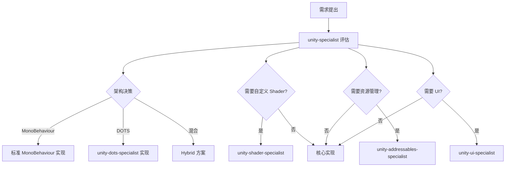

# Unity Agent 协作指南

本指南介绍 Unity 引擎下各 Agent 之间的协作模式、工作流程和最佳实践。

---

## 目录

1. [团队结构](#团队结构)
2. [协作模式](#协作模式)
3. [工作流程](#工作流程)
4. [常见场景](#常见场景)
5. [决策升级路径](#决策升级路径)

---

## 团队结构

### 层级关系

```
technical-director
    └── lead-programmer
            └── unity-specialist (Engine Lead)
                    ├── unity-dots-specialist
                    ├── unity-shader-specialist
                    ├── unity-addressables-specialist
                    └── unity-ui-specialist
```

### Agent 职责矩阵

| Agent | 核心职责 | 关键技能 | 典型产出 |
|-------|---------|---------|---------|
| `unity-specialist` | Unity 架构决策、技术方案选型、性能策略 | MonoBehaviour vs DOTS 决策、URP/HDRP 选择、Addressables 策略 | 架构文档、ADR |
| `unity-dots-specialist` | ECS 架构实现、高性能系统 | Entity Component System、Jobs System、Burst 编译器 | DOTS 系统代码 |
| `unity-shader-specialist` | Shader/VFX 开发、渲染优化 | Shader Graph、VFX Graph、URP/HDRP 自定义 | Shader 文件、渲染管线配置 |
| `unity-addressables-specialist` | 资源管理、异步加载、内存优化 | Addressable Groups、Content Delivery、内存分析 | 加载系统、资源策略 |
| `unity-ui-specialist` | UI 系统实现、数据绑定、跨平台输入 | UI Toolkit、UXML/USS、UGUI Canvas | UI 组件、Screen 系统 |

---

## 协作模式

### 1. 架构决策流程



### 2. 委派规则

| 情况 | 由谁处理 |
|------|---------|
| 选择 MonoBehaviour vs DOTS | unity-specialist 决策，unity-dots-specialist 实现 |
| 需要自定义渲染效果 | unity-specialist → 委派给 unity-shader-specialist |
| 资源加载和内存问题 | unity-specialist → 委派给 unity-addressables-specialist |
| UI 框架选择和实现 | unity-specialist → 委派给 unity-ui-specialist |
| 跨系统协调 | unity-specialist 统一协调 |

### 3. 升级规则

| 情况 | 升级给 |
|------|--------|
| 架构选择影响整体项目 | unity-specialist → lead-programmer |
| 性能问题超出引擎优化范围 | unity-specialist → performance-analyst |
| 设计与实现冲突 | unity-specialist → technical-director |
| 多引擎共同问题 | lead-programmer → technical-director |

---

## 工作流程

### 新功能开发流程

```
1. game-designer 完成 GDD
2. unity-specialist 评估技术可行性
   - 选择架构模式 (MonoBehaviour / DOTS / Hybrid)
   - 识别需要的子专家
   - 制定技术方案
3. 子专家并行开发
   - unity-dots-specialist: 核心系统 (如需要)
   - unity-shader-specialist: 视觉效果 (如需要)
   - unity-ui-specialist: 界面实现 (如需要)
   - unity-addressables-specialist: 资源方案 (如需要)
4. unity-specialist 集成和代码审查
5. performance-analyst 性能验证
6. qa-tester 测试验证
```

### Shader 开发协作

```
1. art-director 定义视觉风格
2. unity-shader-specialist 评估技术方案
   - URP 还是 HDRP?
   - Shader Graph 还是 HLSL?
   - 性能预算?
3. 实现 Shader + VFX
4. unity-specialist 审查性能和兼容性
5. 集成到项目
```

### UI 开发协作

```
1. ux-designer 完成 UX 规范
2. unity-ui-specialist 选择 UI 框架
   - UI Toolkit (推荐新项目)
   - UGUI (兼容旧项目)
3. 实现 UI + 数据绑定
4. art-director 视觉审查
5. accessibility-specialist 无障碍审查
```

---

## 常见场景

### 场景 1: 大量实体的高性能模拟

**决策**: 使用 DOTS/ECS

```
unity-specialist: "这个系统需要处理 10000+ 实体，推荐使用 DOTS。"
  → 委派给 unity-dots-specialist 实现 ECS 系统
  → unity-shader-specialist 配合 GPU Instancing 渲染
  → unity-addressables-specialist 处理 Entity Prefab 加载
```

### 场景 2: 自定义后处理效果

**决策**: URP 自定义 Renderer Feature

```
unity-specialist: "需要自定义后处理，推荐 URP Renderer Feature。"
  → 委派给 unity-shader-specialist 实现
  → 使用 Shader Graph + Custom Renderer Feature
```

### 场景 3: 大型项目资源管理

**决策**: Addressables + Content Delivery

```
unity-specialist: "资源超过 500MB，推荐 Addressables。"
  → 委派给 unity-addressables-specialist 设计加载策略
  → 配置 Addressable Groups 和 Labels
  → 实现异步加载和内存管理
```

---

## 决策升级路径

```
Level 1: 子专家内部决策（实现细节）
    ↓ 无法决定
Level 2: unity-specialist 决策（架构和技术方案）
    ↓ 影响整体项目
Level 3: lead-programmer 决策（跨系统集成）
    ↓ 影响项目方向
Level 4: technical-director 决策（技术战略）
```

---

## 最佳实践

1. **Always ask unity-specialist first** — 架构决策由 Engine Lead 统一协调
2. **DOTS 不是默认选择** — 只在确实需要高性能时使用
3. **URP 优先于 HDRP** — 除非项目确实需要 HDRP 的高级渲染特性
4. **UI Toolkit 优先** — 新项目推荐 UI Toolkit，旧项目可继续使用 UGUI
5. **Addressables 尽早集成** — 越早引入 Addressables，后期重构成本越低

---

> **相关文档**: [04-Agents-Reference.md](./04-Agents-Reference.md) | [05-Skills-Reference.md](./05-Skills-Reference.md)
