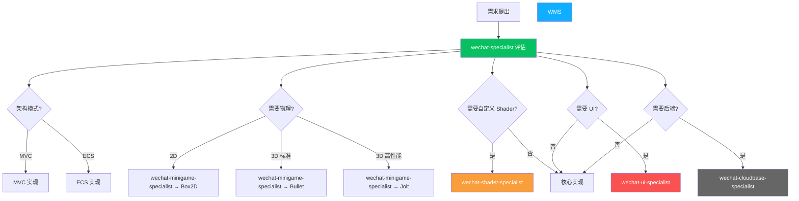
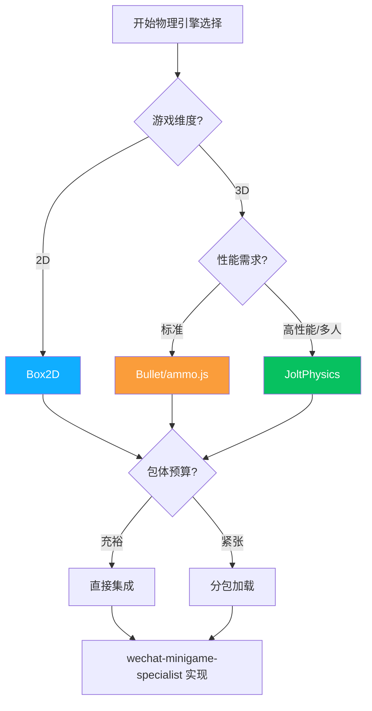

# WeChat Agent Collaboration Guide / 微信代理协作指南

This guide introduces the collaboration patterns, workflows, and best practices among Agents on the WeChat Mini Game platform.

> **中文翻译**：本指南介绍微信小游戏平台下各 Agent 之间的协作模式、工作流程和最佳实践。

---

## 目录

1. [团队结构](#团队结构)
2. [协作模式](#协作模式)
3. [工作流程](#工作流程)
4. [常见场景](#常见场景)
5. [决策升级路径](#决策升级路径)
6. [物理引擎选择指南](#物理引擎选择指南)

---

## 团队结构

### 层级关系

```
technical-director
    └── lead-programmer
            └── wechat-specialist (Engine Lead)
                    ├── wechat-minigame-specialist (物理/WASM/动画)
                    ├── wechat-shader-specialist (WebGL Shader)
                    ├── wechat-ui-specialist (UI/FairyGUI)
                    └── wechat-cloudbase-specialist (云开发)
```

### Agent 职责矩阵

| Agent | 核心职责 | 关键技能 | 典型产出 |
|-------|---------|---------|---------|
| `wechat-specialist` | 微信平台架构决策、MVC/ECS 选择、游戏循环优化、状态/资源管理、音频系统、子专家协调 | wx.* API、TypeScript、包体优化、MVC/ECS 决策 | 架构文档、ADR、平台策略 |
| `wechat-minigame-specialist` | 核心玩法实现、物理引擎集成、WASM 嵌入、骨骼动画运行时 | Box2D/Bullet/JoltPhysics (统一 IPhysicsWorld 接口)、Spine/DragonBones、WASM | 游戏逻辑代码、物理系统、动画系统 |
| `wechat-shader-specialist` | WebGL Shader 开发、渲染管线标准、引擎 Shader 转换 | WebGL 1.0/2.0、GLSL、Unity→GLSL、Unreal→GLSL、Godot→GLSL | Shader 文件、渲染管线配置 |
| `wechat-ui-specialist` | UI 设计和实现、FairyGUI 布局、数据绑定、Screen 管理 | Figma/Sketch、Photoshop/Illustrator、FairyGUI、竖屏适配 | UI 组件、Screen 系统、Sprite Sheet |
| `wechat-cloudbase-specialist` | 微信云开发后端、数据库、云函数、安全规则 | 云函数、MongoDB-like 数据库、存储、反作弊 | 云函数代码、数据库规则、安全策略 |

---

## 协作模式

### 1. 架构决策流程



### 2. 委派规则

| 情况 | 由谁处理 |
|------|---------|
| 选择 MVC vs ECS 架构 | wechat-specialist 决策 |
| 物理引擎选择和集成 | wechat-specialist 决策 → wechat-minigame-specialist 实现 |
| 自定义渲染效果 | wechat-specialist → 委派给 wechat-shader-specialist |
| UI 设计和实现 | wechat-specialist → 委派给 wechat-ui-specialist |
| 后端服务需求 | wechat-specialist → 委派给 wechat-cloudbase-specialist |
| 跨系统协调（如物理+Shader+UI） | wechat-specialist 统一协调 |

### 3. 升级规则

| 情况 | 升级给 |
|------|--------|
| 架构选择影响整体项目 | wechat-specialist → lead-programmer |
| 包体优化超出平台范围 | wechat-specialist → performance-analyst |
| 设计与平台限制冲突 | wechat-specialist → technical-director |
| 多引擎共同问题 | lead-programmer → technical-director |

---

## 工作流程

### 新功能开发流程

```
1. game-designer 完成 GDD
2. wechat-specialist 评估技术可行性
   - 选择架构模式 (MVC / ECS)
   - 识别需要的子专家
   - 制定包体策略（主包 vs 分包）
   - 决定物理引擎（2D→Box2D, 3D标准→Bullet, 3D高性能→Jolt）
3. 子专家并行开发
   - wechat-minigame-specialist: 核心游戏逻辑 + 物理系统
   - wechat-shader-specialist: 自定义渲染效果 (如需要)
   - wechat-ui-specialist: 界面设计和实现 (如需要)
   - wechat-cloudbase-specialist: 后端服务 (如需要)
4. wechat-specialist 集成和代码审查
5. 包体大小检查 (< 4MB 主包)
6. 真机性能测试
7. qa-tester 测试验证
```

### 物理引擎集成流程

```
1. wechat-specialist 根据游戏类型选择物理引擎
   - 2D 游戏 → Box2D (~500KB)
   - 3D 标准需求 → Bullet (~1.5MB)
   - 3D 高性能/多人 → JoltPhysics (~800KB)
2. wechat-minigame-specialist 通过 Skill 初始化引擎
   - /wechat-physics-box2d init
   - /wechat-physics-bullet init
   - /wechat-physics-jolt init
3. 通过统一 IPhysicsWorld 接口实现游戏逻辑
4. 在 game.json 中配置引擎选择
5. 性能测试和优化
```

### Shader 开发协作

```
1. art-director 定义视觉风格
2. wechat-shader-specialist 评估技术方案
   - WebGL 1.0 还是 2.0?
   - 质量层级 (low/medium/high)?
   - 需要从哪个引擎转换?
3. 实现 Shader + 后处理
4. wechat-specialist 审查性能和包体影响
5. 集成到项目
```

### UI 开发协作

```
1. ux-designer 完成 UX 规范（竖屏优先）
2. wechat-ui-specialist 设计和实现
   - Figma/Sketch 原型
   - Photoshop/Illustrator 切图
   - FairyGUI 拼装 + 数据绑定 + Screen 管理
3. art-director 视觉审查
4. accessibility-specialist 无障碍审查
5. 真机适配测试（安全区域、刘海屏、Home Indicator）
```

---

## 常见场景

### 场景 1: 2D 物理游戏（平台跳跃）

**决策**: MVC + Box2D

```
wechat-specialist: "2D 平台跳跃游戏，推荐 MVC 架构 + Box2D 物理引擎。"
  → wechat-minigame-specialist: /wechat-physics-box2d init 0 -9.8
  → wechat-ui-specialist: 竖屏 UI 设计，FairyGUI 数据绑定
  → wechat-shader-specialist: 基础 2D Sprite Shader
  → wechat-cloudbase-specialist: 排行榜云函数（如需要）
```

### 场景 2: 3D 游戏需要物理碰撞

**决策**: MVC + Bullet + WebGL 2.0

```
wechat-specialist: "3D 游戏需要碰撞检测，推荐 Bullet 物理引擎 + WebGL 2.0。"
  → wechat-minigame-specialist: /wechat-physics-bullet init 0 -9.8 0
  → wechat-shader-specialist: /wechat-shader setup webgl2
  → wechat-ui-specialist: 3D 场景上的 HUD 叠加
  → wechat-cloudbase-specialist: 存档同步云函数
```

### 场景 3: 多人 3D 游戏需要确定性物理

**决策**: ECS + JoltPhysics

```
wechat-specialist: "多人游戏需要确定性物理，推荐 ECS + JoltPhysics。"
  → wechat-minigame-specialist: /wechat-physics-jolt init 0 -9.8 0
  → wechat-shader-specialist: 3D 渲染优化，质量层级 fallback
  → wechat-cloudbase-specialist: 实时对战云函数 + 数据库监听
  → wechat-ui-specialist: 多人对战 HUD + Screen 导航
```

### 场景 4: 从 Unity 迁移 Shader

```
wechat-specialist: "需要将 Unity Shader 迁移到 WebGL，委派给 shader 子专家。"
  → wechat-shader-specialist: /wechat-shader convert unity Assets/Shaders/Effect.shader
  → 自动转换 HLSL → GLSL
  → 性能优化和移动端适配
  → 质量层级 fallback 创建
```

---

## 物理引擎选择指南



| 引擎 | WASM 大小 | 优势 | 劣势 | 适用场景 |
|------|-----------|------|------|----------|
| Box2D | ~500KB | 轻量、2D 专用、成熟 | 仅 2D | 平台跳跃、物理解谜 |
| Bullet | ~1.5MB | 功能全面、软体支持 | 包体较大 | 3D 游戏、车辆、布料 |
| JoltPhysics | ~800KB | 高性能、确定性、角色控制器 | 社区较小 | 多人 3D、角色动作 |

所有物理引擎通过统一 `IPhysicsWorld` 接口抽象，切换引擎只需修改 `game.json` 配置，游戏逻辑无需改动。

---

## 决策升级路径

```
Level 1: 子专家内部决策（实现细节）
    ↓ 无法决定
Level 2: wechat-specialist 决策（架构和技术方案）
    ↓ 影响整体项目
Level 3: lead-programmer 决策（跨系统集成）
    ↓ 影响项目方向
Level 4: technical-director 决策（技术战略）
```

---

## 最佳实践

1. **Always ask wechat-specialist first** — 平台架构决策由 Engine Lead 统一协调
2. **TypeScript 优先** — 所有 JavaScript 代码使用 TypeScript 编写
3. **AAC 音频优先** — BGM/SFX 使用 AAC 格式，MP3 作为备选
4. **4MB 主包意识** — 每次添加新功能都评估包体影响
5. **竖屏优先设计** — UI 默认按竖屏设计，再考虑横屏适配
6. **物理引擎统一接口** — 通过 `IPhysicsWorld` 接口操作，配置驱动选择引擎
7. **WASM 懒加载** — 物理引擎 WASM 模块按需加载，不放入主包
8. **分包策略** — 大型资源（Spine/DragonBones 数据、音频、纹理）放入分包

---

## 技术规范速查

| 规范 | 要求 |
|------|------|
| 开发语言 | TypeScript（首选） |
| 音频格式 | AAC（首选）、MP3（备选） |
| 主包大小 | < 4MB |
| 物理引擎 | 通过 IPhysicsWorld 接口抽象 |
| UI 框架 | FairyGUI + 数据绑定 + Screen 管理 |
| Shader | WebGL GLSL，支持 Unity/Unreal/Godot 转换 |
| 后端 | 微信云开发（云函数 + 数据库 + 存储） |
| 合规 | 实名制 + 防沉迷 |

---

> **相关文档**: [04-Agents-Reference.md](./04-Agents-Reference.md) | [05-Skills-Reference.md](./05-Skills-Reference.md) | [10-WeChat-Mini-Game-Guide.md](./10-WeChat-Mini-Game-Guide.md)
