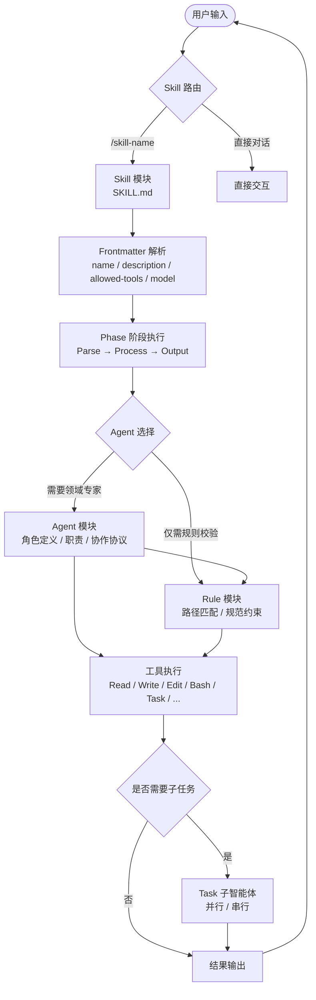
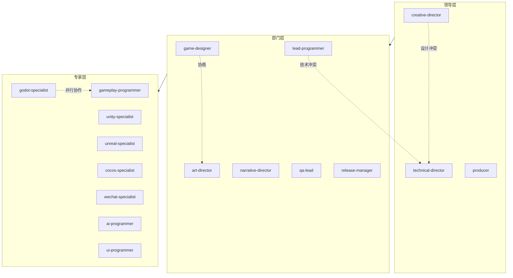
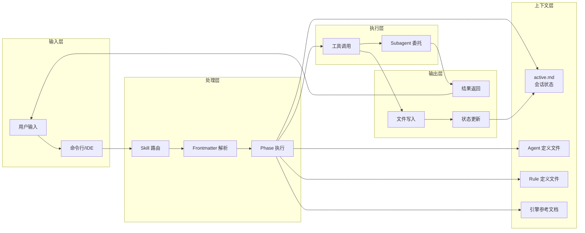
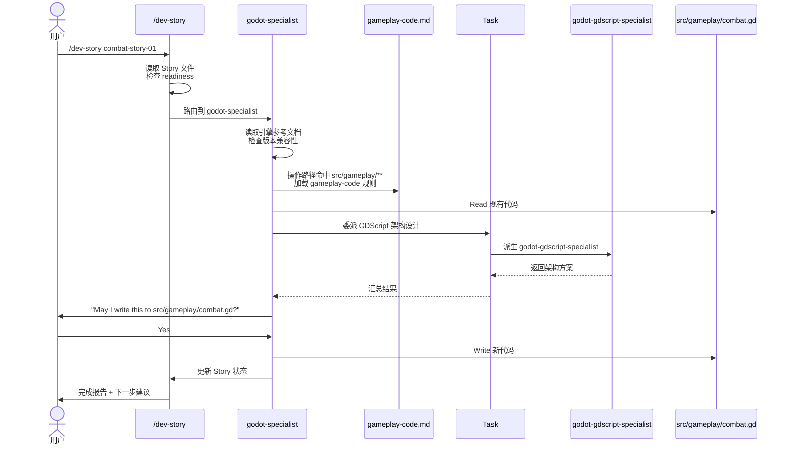

# 提示词工程流程图与模块关系

本文档通过流程图和说明梳理 CodeBuddy 提示词工程的核心模块及其调用、委托、规则触发关系。

---

## 一、全景流程图

### 流程说明

1. **用户输入**：用户通过斜杠命令（如 `/bug-report`）或自由文本与系统交互。
2. **Skill 路由**：系统解析输入，若匹配斜杠命令则加载对应 `SKILL.md`。
3. **Frontmatter 解析**：读取 YAML 元数据，确认工具权限、模型层级和调用参数。
4. **Phase 执行**：按 SKILL.md 中定义的阶段逐步执行（如 Parse → Process → Output）。
5. **Agent 选择**：若任务需要领域专家，加载对应 Agent 定义文件，注入角色上下文。
6. **Rule 匹配**：检查目标文件路径是否命中任何 Rule 的 `paths`，若命中则注入规范约束。
7. **工具执行**：调用 Read、Write、Edit、Bash、Task 等工具完成具体操作。
8. **子任务委托**：复杂任务通过 `Task` 工具派生 Subagent 并行或串行处理。
9. **结果输出**：将最终结果返回给用户，并更新持久化状态文件。

---

## 二、核心模块说明

### 2.1 Skill 模块

- **定义位置**：`.codebuddy/skills/<name>/SKILL.md`
- **核心作用**：将用户输入的斜杠命令转化为结构化工作流
- **关键属性**：
  - `name`：命令标识（如 `bug-report`）
  - `description`：功能描述，用于路由决策和 `/help` 展示
  - `argument-hint`：参数提示，指导用户输入
  - `user-invocable`：是否允许用户直接调用（`true`/`false`）
  - `allowed-tools`：该 Skill 可调用的工具白名单（如 `Read, Glob, Grep, Write`）
  - `model`：指定模型层级（`haiku` / `sonnet` / `opus`）
- **内容结构**：
  - 阶段划分（Phase 1, Phase 2A, Phase 2B...）
  - 每阶段的输入、处理逻辑、输出模板
  - 边界情况（Edge Cases）
  - 协作协议（Collaborative Protocol）
  - 下一步建议（Next Steps）

### 2.2 Agent 模块

- **定义位置**：`.codebuddy/agents/<name>.md`
- **核心作用**：提供领域专家级的协作与实施能力
- **关键属性**：
  - `name`：Agent 标识
  - `description`：职责描述，用于路由和协调决策
  - `tools`：可用工具集（通常比 Skill 更宽泛）
  - `model`：模型层级
  - `maxTurns`：最大对话轮数
- **内部结构**：
  - **协作协议（Collaboration Protocol）**：实施前必须阅读设计文档、询问架构问题、先提出架构方案再编码、写文件前请求批准
  - **核心职责（Core Responsibilities）**：该 Agent 负责的技术领域
  - **最佳实践（Best Practices）**：该领域内的编码/设计规范
  - **委托地图（Delegation Map）**：汇报对象、委托对象、升级目标、协作对象
  - **禁止事项（Must NOT Do）**：明确划定的能力边界，防止越权

### 2.3 Rule 模块

- **定义位置**：`.codebuddy/rules/<name>.md`
- **核心作用**：按文件路径（Glob 模式）匹配，为对应目录的代码或文档提供规范性约束
- **关键属性**：
  - `paths`：作用路径列表（如 `"src/ai/**"`）
- **内容形式**：逐项规则列表，直接约束代码风格、架构决策、性能预算、安全要求等
- **触发方式**：被动触发，任何文件操作只要路径匹配即自动生效，与具体 Skill 或 Agent 无关

### 2.4 Hook 模块

- **定义位置**：`.codebuddy/hooks/*.sh`
- **核心作用**：在特定会话事件或 Git 钩子点自动执行脚本
- **常见钩子**：
  - `session-start.sh`：会话启动时检测并预览 `active.md`
  - `pre-commit.sh`：提交前检查格式、运行测试
  - `statusline.sh`：生成状态行信息
- **与其他模块的关系**：Hook 为 Skill 和 Agent 的调用准备环境，本身不直接参与业务逻辑

---

## 三、模块间关系详解

| 关系 | 方向 | 说明 |
|------|------|------|
| **Skill → Agent** | 单向调用 | Skill 通过 `Task` 工具或内置路由逻辑调用对应领域的 Agent。例如 `/dev-story` 根据技术栈路由到 `gameplay-programmer` 或引擎专家。 |
| **Skill → Rule** | 被动触发 | Skill 执行过程中，若操作路径命中 Rule 的 `paths`，则自动应用对应规则约束。Skill 本身不直接引用 Rule。 |
| **Agent → Agent** | 委托/协作 | Agent 通过委托地图进行上下级汇报与平级协作。垂直委托不跳级，平级协商不决策。 |
| **Agent → Skill** | 建议调用 | Agent 可建议用户运行特定 Skill（如 "Run `/bug-triage` to refresh"），但不直接执行 Skill。 |
| **Rule → 全局** | 被动约束 | Rule 是被动触发的，任何文件操作只要路径匹配即生效，与具体 Skill 或 Agent 无关。 |
| **Hook → Skill/Agent** | 前置准备 | Hook 在会话生命周期事件点触发，可自动加载状态、检查环境，为 Skill 和 Agent 的调用做准备。 |
| **Agent → Tools** | 直接调用 | Agent 通过声明的 `tools` 直接调用 Read、Write、Edit、Bash、Task 等工具。 |
| **Task → Subagent** | 派生 | `Task` 工具在当前会话内派生 Subagent，Subagent 加载目标 Agent 的定义文件，独立处理后返回结果。 |

---

## 四、协作层级图

### 层级规则

1. **垂直委托**：领导层 → 部门层 → 专家层，复杂决策不得跨层级跳过。
2. **平级协商**：同一层级可相互咨询（如 `game-designer` 与 `art-director`），但无权在对方领域做 binding 决策。
3. **冲突升级**：平级冲突或跨域冲突升级到共同上级；若无共同上级，设计冲突升级到 `creative-director`，技术冲突升级到 `technical-director`。
4. **变更传播**：当设计变更影响多个领域时，`producer` 协调传播。

---

## 五、数据流与上下文管理

### 上下文管理要点

1. **文件即内存**：关键决策和进度写入磁盘文件（如 `production/session-state/active.md`），而非仅依赖会话内存。
2. **增量写入**：创建多章节文档时，先写骨架（所有标题），再逐节讨论、逐节写入，保持上下文窗口只容纳当前章节。
3. **主动压缩**：在上下文使用率达到 60%-70% 时主动触发 `/compact`，保留关键决策和文件引用。
4. **崩溃恢复**：新会话启动时，`session-start.sh` 自动检测 `active.md`，Agent 读取后恢复上下文。
5. **模型层级**：
   - **Haiku**（MiniMax-M2.7）：只读状态检查、格式化、简单查找
   - **Sonnet**（DeepSeek-V4-Flash）：实现、设计撰写、单系统分析（默认）
   - **Opus**（GLM-5.1）：多文档综合、高 stakes 阶段门控裁决

---

## 六、Skill → Agent → Rule 的交互示例

以 `/dev-story` 实施一个 Godot 战斗系统故事为例：

### 关键观察

1. **Skill 负责流程 orchestration**：`/dev-story` 控制整体流程（读取、检查、路由、更新状态）。
2. **Agent 负责领域实施**：`godot-specialist` 提供引擎专业知识，但不直接决定游戏设计。
3. **Rule 被动注入约束**：`gameplay-code.md` 在操作 `src/gameplay/**` 时自动生效，Agent 必须遵循。
4. **Subagent 处理子任务**：GDScript 架构细节委派给 `godot-gdscript-specialist`，主会话保持干净。
5. **用户批准关键操作**：写入文件前必须显式询问用户（"May I write...?"），这是协作协议的核心。
