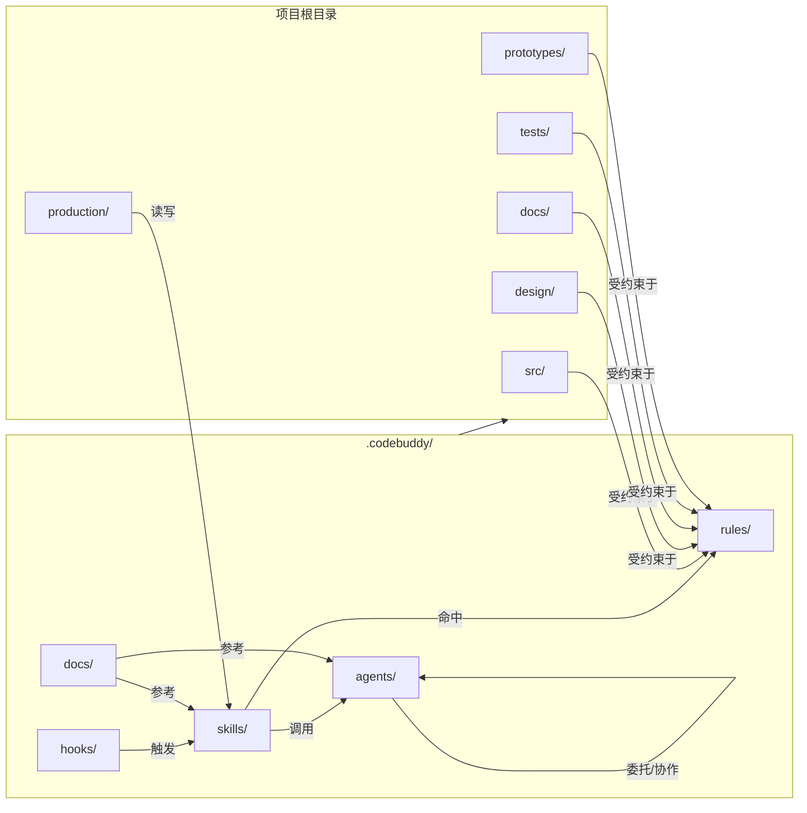

# 目录关系参考

本文档说明项目中各目录的存放规则与功能边界，帮助学习者快速定位提示词工程相关的文件。

---

## 一、根目录结构

| 目录 | 功能说明 | 提示词工程相关性 |
|------|----------|------------------|
| `.codebuddy/` | CodeBuddy 核心配置与提示词工程文件库 | **核心目录**，所有 Skill、Agent、Rule 均存放于此 |
| `src/` | 游戏源代码（核心、玩法、AI、网络、UI、工具） | Rule 文件的作用目标，Agent 实施代码修改的位置 |
| `assets/` | 游戏资产（美术、音频、特效、着色器、数据） | `asset-audit` 和 `asset-spec` Skill 的作用域 |
| `design/` | 游戏设计文档（GDD、叙事、关卡、平衡） | `design-system`、`design-review` 等 Skill 的读写目标 |
| `docs/` | 技术文档（架构、API、事后分析、引擎参考） | `create-architecture`、`architecture-decision` 等 Skill 的输出目录 |
| `tests/` | 测试套件（单元、集成、性能、试玩） | `test-setup`、`test-helpers`、`test-evidence-review` 的作用域 |
| `tools/` | 构建与流水线工具（CI、构建、资产流水线） | `devops-engineer` Agent 和 `setup-engine` Skill 的相关目录 |
| `prototypes/` | 可丢弃的原型（与 `src/` 隔离） | `prototype` Skill 的专用工作区，标准较宽松 |
| `production/` | 生产管理（冲刺、里程碑、发布、Bug 追踪） | `sprint-plan`、`bug-report`、`milestone-review` 等 Skill 的读写目标 |
| `CCGS Skill Testing Framework/` | 技能测试框架相关文档 | `skill-test` 的测试用例与验证标准存放处 |

---

## 二、`.codebuddy/` 子目录详解

### 2.1 `agents/` — 智能体定义库

- **文件数量**：63 个 `.md` 文件
- **存放规则**：每个 Agent 一个文件，文件名为 Agent 标识符（如 `godot-specialist.md`）
- **功能**：定义虚拟协作者的角色、职责、协作协议、最佳实践、委托地图和禁止事项
- **命名规范**：使用小写字母和连字符（kebab-case），如 `gameplay-programmer.md`

### 2.2 `skills/` — 技能定义库

- **目录数量**：96 个子目录
- **存放规则**：每个 Skill 一个独立子目录，目录名即 Skill 标识符，内部必须包含 `SKILL.md`
- **功能**：定义斜杠命令的行为逻辑、执行阶段、输出模板、工具权限和模型层级
- **命名规范**：目录名使用小写字母和连字符，如 `bug-report/`、`create-stories/`

### 2.3 `rules/` — 规则定义库

- **文件数量**：11 个 `.md` 文件
- **存放规则**：每个 Rule 一个文件，按作用域命名（如 `ai-code.md`、`ui-code.md`）
- **功能**：为匹配 `paths` 的目录提供代码规范、架构约束和性能预算
- **触发方式**：被动触发，任何文件操作只要路径命中 `paths` 即自动生效

### 2.4 `docs/` — 内部参考文档

- **文件数量**：60+ 个 `.md` 文件和 1 个 `.yaml` 文件
- **存放规则**：按主题分文件存放，如 `directory-structure.md`、`coordination-rules.md`
- **功能**：提供项目结构规范、协调规则、上下文管理策略、技能参考、模板和审查流程说明
- **重要子目录**：
  - `templates/` — 38 个文档模板（GDD、ADR、Story、Epic、测试计划等），供 Skill 创建新文档时使用
  - `templates/collaborative-protocols/` — 3 个协作协议模板（design/implementation/leadership），定义 Agent 与用户协作的行为规范
  - `hooks-reference/` — 6 个钩子详细参考文档，说明各 Git 钩子事件的触发条件和校验规则

### 2.5 `hooks/` — 钩子脚本

- **文件数量**：12 个 `.sh` 文件
- **存放规则**：Shell 脚本，按事件命名（如 `session-start.sh`、`pre-commit.sh`）
- **功能**：在特定会话事件或 Git 钩子点自动执行，用于环境检查、状态恢复、格式化等

### 2.6 其他辅助目录

| 子目录 | 功能说明 |
|--------|----------|
| `agent-memory/` | Agent 持久化记忆存储目录，用于跨会话保留关键上下文 |
| `plans/` | 计划文件存储目录，存放由 CodeBuddy 生成的执行计划 |
| `teams/` | 智能体团队配置目录（实验性多会话协作功能） |

---

## 三、`docs/` 子目录详解（根目录下）

| 子目录 | 功能说明 | 提示词工程相关性 |
|--------|----------|------------------|
| `architecture/` | 架构文档（ADR、蓝图、控制清单） | `create-architecture`、`architecture-decision` 的输出位置 |
| `engine-reference/` | 引擎 API 快照（版本锁定） | `setup-engine` 填充的参考文档，Agent 实施前必须查阅 |
| `examples/` | 示例文档 | 学习参考 |
| `Readme/` | 说明文档集合 | **已忽略**，不参与学习 |
| `registry/` | 实体注册表相关文档 | `consistency-check` 和 `content-audit` 的数据来源 |

---

## 四、`production/` 子目录详解

| 子目录 | 功能说明 | 相关 Skill / Agent |
|--------|----------|---------------------|
| `sprints/` | 冲刺计划与状态文件 | `sprint-plan`、`sprint-status` |
| `milestones/` | 里程碑跟踪文档 | `milestone-review` |
| `releases/` | 发布记录与清单 | `release-checklist`、`launch-checklist` |
| `qa/bugs/` | Bug 报告与追踪 | `bug-report`、`bug-triage` |
| `qa/plans/` | QA 测试计划 | `qa-plan` |
| `session-state/` | 会话状态文件（`active.md`，gitignored） | 所有 Skill 和 Agent 共享的持久化状态 |
| `session-logs/` | 会话审计日志（gitignored） | 会话追踪与故障排查 |
| `review-mode.txt` | 审查模式配置 | `start` Skill 在 Phase 3b 中设置 |

---

## 五、设计文档目录（`design/`）

| 子目录 | 功能说明 | 相关 Skill |
|--------|----------|------------|
| `gdd/` | 游戏设计文档（核心概念、系统设计） | `design-system`、`design-review` |
| `narrative/` | 叙事文档（剧情、角色、世界观） | `narrative` Rule 约束范围 |
| `levels/` | 关卡设计文档 | `level-designer` Agent 工作域 |
| `balance/` | 平衡数据与公式 | `balance-check` |
| `ux/` | 用户体验规格文档 | `ux-design`、`ux-review` |
| `art-bible/` | 视觉身份规范 | `art-bible` |

---

## 六、目录交互关系图

---

## 七、文件定位速查

如果你要找…… | 去这个目录
---|---
某个 Skill 的定义 | `.codebuddy/skills/<skill-name>/SKILL.md`
某个 Agent 的定义 | `.codebuddy/agents/<agent-name>.md`
某个 Rule 的定义 | `.codebuddy/rules/<rule-name>.md`
当前会话状态 | `production/session-state/active.md`
引擎 API 参考 | `docs/engine-reference/<engine>/`
项目目录结构规范 | `.codebuddy/docs/directory-structure.md`
Agent 协调规则 | `.codebuddy/docs/coordination-rules.md`
上下文管理策略 | `.codebuddy/docs/context-management.md`
所有斜杠命令速查 | `.codebuddy/docs/skills-reference.md`
Agent 名册 | `.codebuddy/docs/agent-roster.md`
