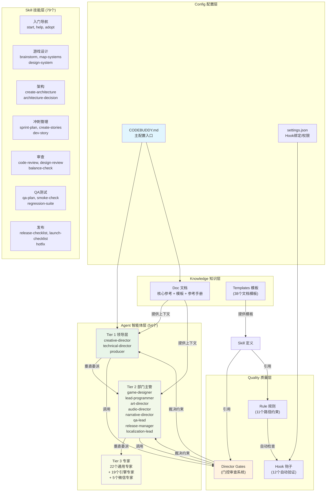
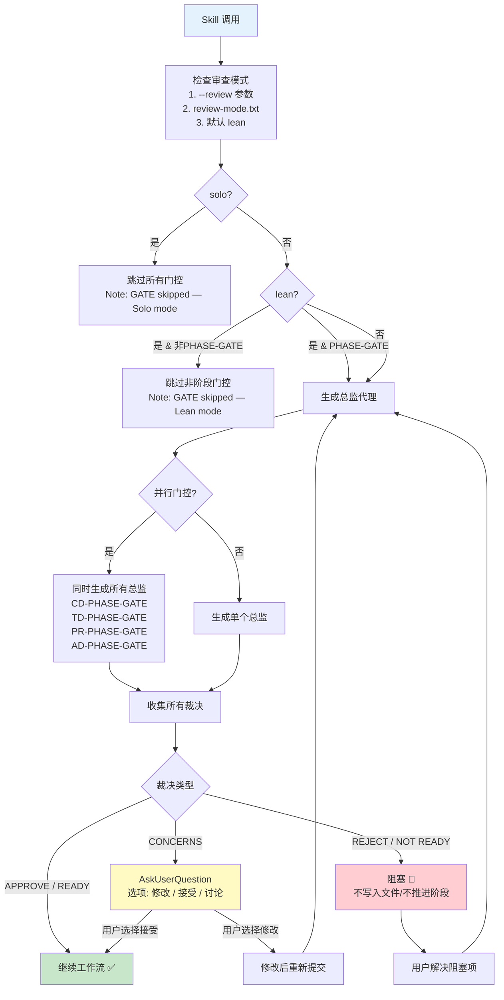
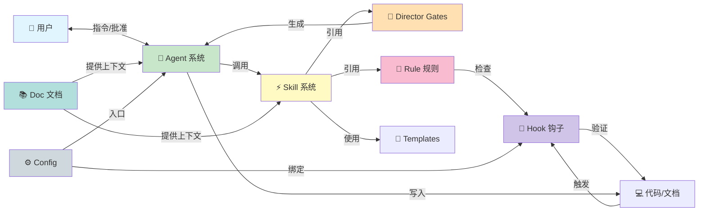

# Claude Code Game Studios — 提示词工程架构分析 / Prompt Engineering Architecture Analysis

## 一、六大模块概述 / Six Major Modules Overview

本提示词工程由**六大核心模块**组成，共同构成了一个完整的游戏开发AI代理协作系统。

This prompt engineering consists of **six core modules** that together form a complete AI agent collaboration system for game development.

| 模块 / Module | 文件数 / Files | 核心职责 / Core Responsibility |
|---|---|---|
| **1. Agent 代理系统** | 54 | 定义智能体的身份、职责、决策框架和委派关系 |
| **2. Skill 技能系统** | 79 | 定义可执行的工作流命令（斜杠命令） |
| **3. Rule 规则系统** | 11 | 按文件路径约束代码和文档的质量规则 |
| **4. Hook 钩子系统** | 12 | 自动触发的验证脚本（提交/推送/会话等） |
| **5. Doc 文档系统** | 61 | 核心参考文档、模板和参考手册 |
| **6. Config 配置系统** | 2 | 主配置入口和设置绑定 |

---

## 二、模块关系图 / Module Relationship Diagram



---

## 三、Agent 层级与委派流程图 / Agent Hierarchy & Delegation Flow

```mermaid
graph TD
    subgraph Tier1["Tier 1 — 领导层 (决策权威)"]
        CD["creative-director<br/>🎨 创意总监<br/>Model: Kimi-k2.5"]
        TD["technical-director<br/>⚙️ 技术总监<br/>Model: GLM-5.1"]
        PR["producer<br/>📋 制作人<br/>Model: DeepSeek-V3.2"]
    end

    subgraph Tier2["Tier 2 — 部门主管 (领域专家)"]
        GD["game-designer<br/>🎮 游戏设计师"]
        LP["lead-programmer<br/>💻 主管程序员"]
        AD["art-director<br/>🖼️ 美术总监"]
        AUD["audio-director<br/>🔊 音频总监"]
        ND["narrative-director<br/>📖 叙事总监"]
        QL["qa-lead<br/>🧪 QA主管"]
        RM["release-manager<br/>🚀 发布经理"]
        LL["localization-lead<br/>🌍 本地化主管"]
    end

    subgraph Tier3["Tier 3 — 专家 (执行者)"]
        SD["systems-designer"]
        LD["level-designer"]
        ED["economy-designer"]
        GP["gameplay-programmer"]
        EP["engine-programmer"]
        AIP["ai-programmer"]
        NP["network-programmer"]
        TP["tools-programmer"]
        UIP["ui-programmer"]
        TA["technical-artist"]
        SND["sound-designer"]
        WRT["writer"]
        WB["world-builder"]
        QAT["qa-tester"]
        PA["performance-analyst"]
        DO["devops-engineer"]
        AE["analytics-engineer"]
        UX["ux-designer"]
        PT["prototyper"]
        SE["security-engineer"]
        AS["accessibility-specialist"]
        LO["live-ops-designer"]
        CM["community-manager"]
    end

    subgraph Engine["引擎专家组"]
        US["unreal-specialist + 4子专家"]
        UN["unity-specialist + 4子专家"]
        GS["godot-specialist + 4子专家"]
        WS["wechat-specialist + 4子专家"]
    end

    CD -->|"创意约束"| GD
    CD -->|"视觉方向"| AD
    CD -->|"声音方向"| AUD
    CD -->|"故事方向"| ND
    
    TD -->|"代码架构"| LP
    TD -->|"引擎风险"| US
    TD -->|"引擎风险"| UN
    TD -->|"引擎风险"| GS
    
    PR -->|"冲刺协调"| QL
    PR -->|"发布管理"| RM
    PR -->|"本地化"| LL

    GD -->|"子系统设计"| SD
    GD -->|"关卡设计"| LD
    GD -->|"经济设计"| ED
    
    LP -->|"游戏逻辑"| GP
    LP -->|"引擎系统"| EP
    LP -->|"AI系统"| AIP
    LP -->|"网络"| NP
    LP -->|"工具"| TP
    LP -->|"UI"| UIP
    
    AD -->|"技术美术"| TA
    AUD -->|"音效设计"| SND
    ND -->|"文本"| WRT
    ND -->|"世界构建"| WB

    style CD fill:#c8e6c9
    style TD fill:#bbdefb
    style PR fill:#ffe0b2
```



---

## 四、7阶段工作流程图 / 7-Phase Workflow Pipeline

```mermaid
graph LR
    subgraph P1["1. Concept 概念"]
        B["/brainstorm"]
        PS["/project-stage-detect"]
    end

    subgraph P2["2. Systems Design 系统设计"]
        MS["/map-systems"]
        DS["/design-system"]
        QD["/quick-design"]
    end

    subgraph P3["3. Technical Setup 技术设置"]
        CA["/create-architecture"]
        ADR["/architecture-decision"]
        SE2["/setup-engine"]
    end

    subgraph P4["4. Pre-Production 预生产"]
        CE["/create-epics"]
        CS["/create-stories"]
        SP["/sprint-plan"]
    end

    subgraph P5["5. Production 生产"]
        DV["/dev-story"]
        CR["/code-review"]
        SR["/story-readiness"]
    end

    subgraph P6["6. Polish 打磨"]
        BC["/balance-check"]
        PP["/perf-profile"]
        SC["/smoke-check"]
    end

    subgraph P7["7. Release 发布"]
        RC["/release-checklist"]
        LC["/launch-checklist"]
        PN["/patch-notes"]
    end

    P1 -->|"概念锁定"| P2
    P2 -->|"系统定义"| P3
    P3 -->|"架构完成"| P4
    P4 -->|"冲刺计划"| P5
    P5 -->|"功能完成"| P6
    P6 -->|"质量达标"| P7

    P1 -.->|"CD-PILLARS<br/>AD-CONCEPT-VISUAL"| G1["🚦 Gate"]
    P3 -.->|"TD-ARCHITECTURE<br/>LP-FEASIBILITY"| G2["🚦 Gate"]
    P4 -.->|"PR-EPIC<br/>QL-STORY-READY"| G3["🚦 Gate"]
    P5 -.->|"LP-CODE-REVIEW<br/>PR-SPRINT"| G4["🚦 Gate"]
    P7 -.->|"全部PHASE-GATE"| G5["🚦 Gate"]

    style P1 fill:#e8f5e9
    style P2 fill:#f1f8e9
    style P3 fill:#fff8e1
    style P4 fill:#fff3e0
    style P5 fill:#fce4ec
    style P6 fill:#f3e5f5
    style P7 fill:#e8eaf6
```



---

## 五、Director Gate 门控流程图 / Director Gate Flow



---

## 六、协调机制详解 / Coordination Mechanism Details

### 6.1 三层委派体系 / Three-Tier Delegation System

```
用户 (User)
  │
  ├── Tier 1: 领导层 — 战略决策
  │   ├── creative-director: 创意愿景、支柱仲裁
  │   ├── technical-director: 技术架构、引擎风险
  │   └── producer: 范围、时间线、跨部门协调
  │
  ├── Tier 2: 部门主管 — 领域专家
  │   ├── game-designer → systems-designer, level-designer, economy-designer
  │   ├── lead-programmer → gameplay-programmer, engine-programmer, ai-programmer...
  │   ├── art-director → technical-artist, ux-designer
  │   ├── audio-director → sound-designer
  │   ├── narrative-director → writer, world-builder
  │   ├── qa-lead → qa-tester
  │   ├── release-manager → devops-engineer
  │   └── localization-lead → tools-programmer
  │
  └── Tier 3: 专家 — 执行者
      └── 直接执行具体任务
```

### 6.2 门控裁决升级规则 / Gate Verdict Escalation

| 模式 | 行为 | 适用场景 |
|------|------|----------|
| `full` | 所有门控激活 | 团队协作、学习型用户 |
| `lean` | 仅阶段门控 | **默认**——独立开发者 |
| `solo` | 无门控 | Game jams、原型 |

**并行升级规则**：
- 任何 NOT READY / REJECT → 总体裁决最低为 FAIL
- 任何 CONCERNS → 总体裁决最低为 CONCERNS
- 全部 READY / APPROVE → 符合 PASS 条件

### 6.3 上下文管理 / Context Management

- **会话状态**：`production/session-state/active.md` 记录当前任务、完成部分、关键决策
- **增量文件写入**：Skill 按段写入，每段获批准后写入文件
- **协作协议**：所有 Agent 遵循"提问 → 选项 → 决策 → 草案 → 批准"模式

### 6.4 Hook 自动验证 / Hook Auto-Validation

| Hook | 触发时机 | 功能 |
|------|----------|------|
| `validate-commit` | git commit | 检查提交消息格式和内容 |
| `validate-push` | git push | 检查推送前代码质量 |
| `validate-assets` | 资产变更 | 检查资产命名和大小 |
| `session-start` | 会话开始 | 检测项目状态 |
| `detect-gaps` | 定期 | 检测文档缺口 |
| `pre-compact` | 上下文压缩前 | 保存关键状态 |
| `log-agent` | 代理调用 | 记录代理活动日志 |

### 6.5 Rule 路径约束 / Rule Path Constraints

11个 Rule 文件按文件路径模式匹配，自动应用于：
- `**/gameplay/**` → gameplay-code 规则
- `**/engine/**` → engine-code 规则  
- `**/ai/**` → ai-code 规则
- `**/network/**` → network-code 规则
- `**/ui/**` → ui-code 规则
- `design/gdd/**` → design-docs 规则
- `design/narrative/**` → narrative 规则
- `assets/data/**` → data-files 规则
- `tests/**` → test-standards 规则
- `**/prototype/**` → prototype-code 规则
- `**/shader/**` → shader-code 规则

---

## 七、模块间数据流 / Inter-Module Data Flow



---

## 八、关键设计原则 / Key Design Principles

1. **用户驱动的协作**：Agent 是顾问，不是自主执行者。所有关键决策由用户做出。
2. **门控驱动的质量**：Director Gate 系统确保每个阶段的质量，防止"垃圾进垃圾出"。
3. **分层委派**：问题在最低能解决的层级解决，只有无法解决的才升级。
4. **模式可选**：full/lean/solo 三种审查模式适应不同开发节奏。
5. **上下文保持**：session-state 机制确保跨会话的连续性。
6. **规则自动执行**：Rule + Hook 组合确保代码和文档质量自动检查。
7. **模板标准化**：38个模板确保输出格式一致，减少重复劳动。
8. **引擎无关**：支持 Unreal/Unity/Godot/WeChat 四大平台，各有专家子团队。

---

*本文档基于对 Claude Code Game Studios 提示词工程的完整分析生成。*
*Generated from complete analysis of the Claude Code Game Studios prompt engineering system.*
